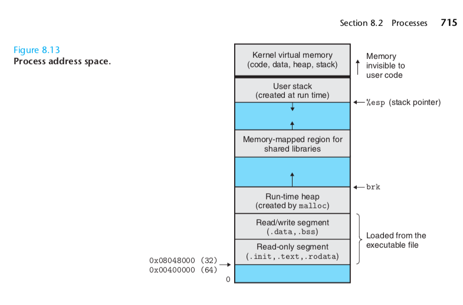

# 后端总览 

## 网络
* 网络协议的分层

### OSI model


### 网络协议的编码


### big and little endian


### 网络协议分类:
* 文本协议 (http)
    * 
* 二进制协议 (tcp, grpc)


## 操作系统
* Protection ring:
* system call:
* 端口号:
    * 前1024个端口号是系统占用的, 后面可以用户自己去领, 不需要sudo权限

* 进程
    * 僵尸进程: 父进程关闭没有正确回收子进程

* 线程
    * race condition:

* 执行文件

* IO
    * poll
    * epoll

* sockets
* 环境变量


### <span style="color:blue;">protection ring<span>


### <span style="color:blue;">system call<span>


应用程序请求网络


###  <span style="color:blue;">进程<span>

进程是操作系统虚拟的一个概念, 操作系统会为每一个可执行文件创建一个进程实例, 以保持对该程序状态的维护.
包括内存分配, 执行状态, 优先级, 以及对各个进程的调度. 




context switching


### <span style="color:blue;">线程<span>


race condition:

```c
if (x == 5) // The "Check"
{
   y = x * 2; // The "Act"

   // If another thread changed x in between "if (x == 5)" and "y = x * 2" above,
   // y will not be equal to 10.
}
```

线程池:

为了复用线程资源而创建出来的池子.


### <span style="color:blue;">IO: <span>

IO Multiplexing:
正常的IO操作会block程序的执行, 所以为了解决这个问题, 可以的方式是通过在每一次读取开启一个新的线程.
但这样会比较浪费线程资源. 代码也会很脏. 操作系统底层就已经提供了 IO Multiplexing 的机制.

[select vs poll vs epoll](http://devarea.com/linux-io-multiplexing-select-vs-poll-vs-epoll/#.XJRIOBMzbOQ)


### <span style="color:blue;">sockets (套接字):<span>

sockets 使用来创建网络连接的一个关键, 目前基本上所有的网络连接都是基于TCP和UDP的. 操作系统底层实现了sockets
的基本实现. 基于TCP/UDP协议上层实现的协议都是用sockets来实现的. programming sockets 的关键就是ip + port + 
协议类型.
然后可以通过 byte stream 来操作数据.

### <span style="color:blue;">环境变量:<span>
环境变量一种可以被应用程序感知的机制, 系统的进程基本上都是由其他进程fork出来的, 子进程自动继承父进程的环境变量.

```
export ANDROID_SDK_ROOT=$HOME/workspace/tools/android_sdk
export PATH=$ANDROID_SDK_ROOT/tools:$ANDROID_SDK_ROOT/platform-tools:$PATH

// 
NODE_ENV=PRODUCTION node app.js

// 
process.env.NODE_ENV
```


## 虚拟化

* docker
* traditional virtualization


虚拟化的优势:
* 节省服务器资源
* 隔离/安全
* 维护也简单, 直接reset虚拟的os, 而不用真正重装, 相当于一键还原
* 配置服务器的资源也就更灵活


docker 的优势:
* 省去复杂的安装配置
* 开发和部署是一样的环境
* 运行速度更快

## 架构 
* 后端常用架构
    * https://www.digitalocean.com/community/tutorials/5-common-server-setups-for-your-web-application

* 微服务
* monolithic 

## 数据库
* SQL:
    * mysql, oracle, sqlite

* NoSQL:
    * mongodb, neo4j, 

###

### SQL vs NoSQL database :

SQL:


neo4j:


### <a href="https://towardsdatascience.com/cap-theorem-and-distributed-database-management-systems-5c2be977950e" style="color:blue;">CAP Theorem:</a>


## 其他

* 缓存
    * 客户端缓存
        * http, cache api (就browser环境来说)
    * 服务端缓存
        * 静态页面缓存
        * 数据库缓存
        * 动态数据缓存

* 网关
    * https://blog.risingstack.com/building-an-api-gateway-using-nodejs/

* RPC (remote procedure call): 你可以理解为一次方法调用, 只不过实现在服务端

* 消息队列: 生产端/消费端.

* 代理:

## reference 

* book: *Attacking.Network.Protocols.2017.12*